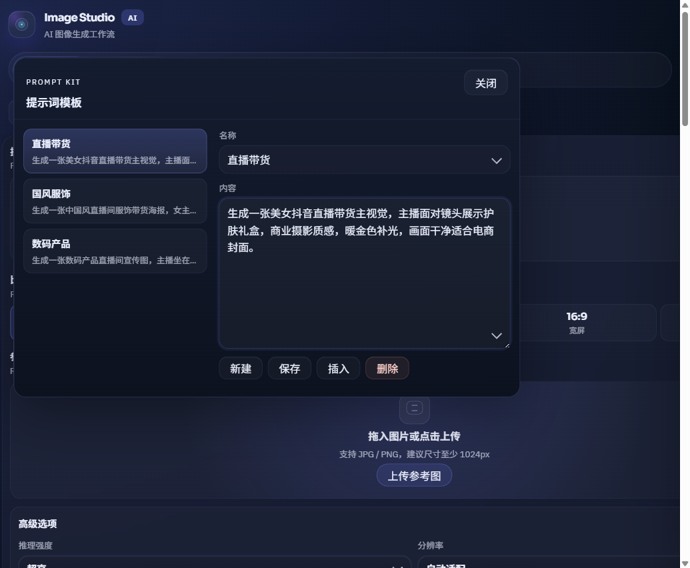

# GPT-Image2-Studio

一个面向本地创作流的图片生成工作台：用浏览器管理提示词、参考图、比例、分辨率、图片拆解、PPT 生成和历史画廊，通过本机 Node 服务转发 `Responses API`，并使用内置 `image_generation` 工具调用 `gpt-image-2` 生成图片。

> API Key 只保存在本机 `.local/config.json`，公开仓库不内置私人 Base URL，生成结果默认写入 Windows 图片目录，不会随源码提交到 GitHub。

## 功能概览

| 模块 | 能力 |
| --- | --- |
| Studio | 提示词输入、参考图上传、比例选择、分辨率选择、推理强度选择、输出格式选择、实时生成状态 |
| 图片拆解 | 上传单张源图生成高信息密度拆解信息图，支持比例、分辨率、标注语言、自定义语言、两侧说明卡片和结果缩略图切换 |
| 套图模式 | 独立于提示词模式的电商营销套图生成，支持生成前计划预览、计划内单张提示词微调、独立参考图用途标签与智能识别、历史参考图重传后的手动绑定、4/6/8/10/12 张快捷数量、营销场景推荐角色组合、1577 个四级类目行业模板的逐级选择和搜索、场景内角色专属提示词、12 个图片角色自选、目标语言、尺寸规格单位换算、中文图片类型文件名、单张提示词微调后重生成和未完成项补齐 |
| 文章插图 | 先完整解析多来源文章包，生成可编辑分镜、风格圣经、人物/场景设定和重点参考图，再确认生成正式插图；数量由模型按文章节奏建议，不复用套图固定张数 |
| PPT | 上传文档、输入文本或主题生成 PPT 大纲、逐页生成幻灯片、补齐缺页、标注重绘单页、导出 `.pptx` |
| 队列 | 最多 20 个生成任务排队，最多 4 个任务并发请求，尚未开始的排队任务可取消 |
| 模板 | 本地提示词模板，可创建、修改、插入和删除 |
| 画廊 | 按日期分组、本地缩略图、关键词筛选、日期筛选、尺寸筛选、参考图筛选 |
| 本地服务 | 静态页面托管、配置保存、SSE 转发、图片写入、输出目录打开 |
| 命令行 | 支持直接用 `npm run generate` 生成单张图片 |
| Windows 安装包 | 使用系统自带 IExpress 打包为 `.exe` 安装器，内置当前 Node 运行时 |

## 功能更新

### main 分支更新

- 新增图片拆解模式：在“创作”菜单中独立打开，上传 1 张源图后生成带编号部件标注的拆解信息图，可选择标注语言、比例、分辨率和是否启用两侧说明卡片。
- 套图模式的尺寸规格支持公制、英制、双单位和原文保留；输入 `cm`、`mm`、`in`、`ft`、`ml`、`fl oz`、`kg`、`lb` 等规格后，可在尺寸规格图提示词中自动换算展示。
- 套图规划强化卖点图、场景图、种草图和材质细节图的角色意图，使提示词更强调痛点解决、真实使用场景、真人或结果佐证，以及多窗口材质细节分析。
- 套图图片文件名改用中文图片类型标题，例如 `01-主图-...`、`02-卖点图-...`，避免 `hero`、`benefit` 等内部角色名进入交付文件。
- 图片拆解结果缩略条会把最新完成的结果放到最左侧，生成完成后可直接看到并切换到刚完成的拆解图。

### v0.1.2

- 套图模式新增 1577 个四级电商类目模板，支持悬浮级联选择、三级/四级类目名或编码搜索，并把类目路径和拍摄重点写入套图计划。
- 套图参考图智能识别可输出类目线索，并在匹配到明确四级类目时自动切换行业模板；模糊词会被拦截，避免错误切换到相似类目。
- 前端改为按需加载四级类目模板，进入套图模式或打开类目选择器时再加载大体积模板模块，减少首屏加载压力。
- README、OpenSpec、计划文档和测试同步覆盖 v0.1.2 的套图类目模板行为。

- 新增文章插图模式：支持粘贴正文、上传文本文件和补充说明合并成 article bundle；计划阶段只调用文本模型，输出内容类型、推荐插图数量、风格圣经、人物/场景设定、重点参考图和逐张标准生图提示词；用户确认后再生成参考图和正式插图，并在记录页复制提示词、复制准确题注、重生成单张或继续失败项。
- 新增套图模式：在创作工作台下独立于提示词/参考图模式，单个商品可用 4、6、8、10 或 12 张作为快捷模板；切换营销场景会自动带出推荐图片角色组合，也会为同一图片角色注入不同的场景专属提示词策略；行业模板入口放在下方，主界面只显示当前选择的类目名，点开后用悬浮下拉层从一级逐级进入二级、三级和四级类目，也可按三级/四级类目名或编码搜索 1577 个细分类目模板，旧的基础行业模板不再作为可选项展示；选中四级类目后会自动调整默认角色组合并注入类目拍摄重点；也可从 12 个电商图片角色中自选本次生成组合；可选择目标语言和标准电商、详情页转化、社媒种草、新品发布、活动促销、直播电商、礼品推荐、平台搜索、品牌故事等营销场景，并上传只用于套图的产品参考图；套图参考图可手动标注商品主体、包装清单、材质细节、使用场景、风格参考等用途，也可以智能识别每张图的推荐用途、生成备注和类目线索，识别到明确四级类目时会主动切换模板；复用历史套图后，重传的参考图既会自动匹配历史文件，也可以手动绑定到指定历史参考图；生成前可以先预览每张图的电商计划，并在正式生成前微调单张提示词；套图记录支持单张提示词微调后重生成、补图和补齐未完成项。
- 新增 PPT 生成工作流：支持 PDF / DOCX / PPTX / TXT / MD / CSV 文件、文本材料或主题输入生成演示文稿。
- PPT 页面按 16:9 幻灯片图像生成，可补齐失败页，并支持在单页上涂抹标注后重新生成。
- 新增 PPTX 导出，支持转场效果、自动播放时间和动态组件预设。
- 任务队列改为最多 20 个任务、4 个并发，未开始的排队任务可以直接取消。
- 参数区新增输出格式选择，工作台支持 PNG / JPG 保存。
- 配置中的生成日志会同步任务状态，并在有新动态时显示提示。
- 生成流程增强了流式结果解析、最终图片提取、非流式兜底和上游错误提示。
- 分辨率预设已更新，默认尺寸优先落在 1K 到 2K 区间。

> 高分辨率容易触发生成失败、超时或没有最终图片结果。建议日常最好使用 1K 和 2K 分辨率，需要更大图时再逐档尝试。

## 技术栈

| 层级 | 技术 |
| --- | --- |
| Runtime | Node.js 20+，ES Modules |
| Server | Node 原生 `http` 服务，PPTX 导出依赖 `jszip` 和 `pptxgenjs` |
| Frontend | 原生 HTML / CSS / JavaScript，浏览器端 ESM |
| API | `POST /responses`，结构化大纲生成，`tools[].type = "image_generation"`，`tools[].model = "gpt-image-2"` |
| Streaming | `text/event-stream` / SSE，监听中途预览和最终图片事件 |
| Storage | 本地 `.local/config.json` 保存配置，`Pictures/YYYY-MM/MM-DD/YYYY-MM-DD-prompt/` 保存提示词生图，`Pictures/YYYY-MM/MM-DD/YYYY-MM-DD-style-transfer/` 保存风格迁移图，`Pictures/YYYY-MM/MM-DD/YYYY-MM-DD-reference-analysis/` 保存融图分析生成图，`Pictures/YYYY-MM/MM-DD/YYYY-MM-DD-image-decomposition/` 保存图片拆解图，`Pictures/YYYY-MM/MM-DD/YYYY-MM-DD-creation/商品名-短ID/` 保存套图图片，`Pictures/YYYY-MM/MM-DD/YYYY-MM-DD-article/文章名-短ID/` 保存文章插图，`Pictures/YYYY-MM/MM-DD/YYYY-MM-DD-ppt/PPT名称-短ID/` 保存 PPT 图片和 PPTX，`Pictures/json/creation-sets/`、`Pictures/json/article-illustration-sets/` 和 `Pictures/json/ppt-decks/` 保存清单 |
| Packaging | Windows `iexpress.exe` + `tar.exe`，生成自解压安装包 |

## 快速启动

### 方式一：本地开发启动

```powershell
npm install
npm start
```

启动后打开：

```text
http://localhost:3600
```

如果 `3600` 端口已被占用，可以手动指定端口：

```powershell
$env:PORT="3601"
npm start
```

### 方式二：Windows 启动器

双击项目根目录下的：

```text
launch-studio.cmd
```

启动器会检查端口、拉起 `node server.mjs`，并自动打开浏览器。

### 方式三：命令行生成

```powershell
npm run generate -- --prompt "一张产品海报，明亮商业摄影，干净背景" --size "1024x1536" --quality "high" --format "jpeg"
```

查看命令行帮助：

```powershell
npm run help
```

### 方式四：套图模式

启动工作台后在顶部“创作”菜单中选择“套图模式”，或直接打开：

```text
http://localhost:3600/#creation
```

套图模式面向单个商品生成一组电商营销图。填写商品名称、商品描述和卖点后，可以选择 4 / 6 / 8 / 10 / 12 张套图数量、营销场景、目标语言、比例、分辨率和输出格式；行业模板放在参数区下方，默认只显示一个当前类目按钮，点开后在悬浮下拉层中逐级选择一级、二级、三级和四级类目，也可按三级/四级类目名或编码搜索。选中四级类目后，计划器会把类目路径和对应拍摄重点写入每张生图提示词。也可以上传只属于套图模式的参考图，并为每张参考图标注商品主体、包装清单、材质细节、使用场景或风格参考；智能识别如果拿到明确类目线索，会自动切换到匹配的四级类目模板。复用历史套图后，如果历史参考图需要重传，上传卡片会显示“绑定历史参考图”选择项，可把当前文件手动绑定到指定历史参考图并继承其用途与备注。正式生成前可先点“预览计划”检查每张图的角色、营销文案和提示词，并对单张计划做提示词微调后再生成。

生成后的套图记录在顶部“资产”菜单里的“套图记录”查看。记录页支持搜索商品、场景、行业、四级类目路径或语言，打开对应套图文件夹，批量复制相对路径、完整本地路径和整套提示词，也可以导出提示词文本或套图清单 JSON，并把历史套图显式复用回当前套图工作区继续补图或重生成。

### 方式五：图片拆解

启动工作台后在顶部“创作”菜单中选择“图片拆解”，或直接打开：

```text
http://localhost:3600/#image-decomposition
```

图片拆解模式只接受 1 张源图，适合把产品、设备、服饰、包装或结构清晰的物体生成带编号标注的拆解信息图。上传源图后可选择比例、分辨率、标注语言和是否启用两侧说明卡片；自定义语言需要填写具体语言名。生成结果会显示在右侧预览画布，并在下方缩略条按最新完成优先排列。

### 方式六：文章插图

启动工作台后在顶部“创作”菜单中选择“文章插图”，或直接打开：

```text
http://localhost:3600/#article-illustration
```

文章插图模式会先把粘贴正文、上传的 TXT / MD / CSV / JSON 文本文件和补充说明合并为一个 article bundle，再调用文本模型输出可编辑的分镜表、风格圣经、人物卡、场景卡和重点参考图计划。正式生成前可以调整风格圣经、单张提示词、准确题注和图中文字提示；参考图用于后续插图的一致性控制，正式插图数量由模型根据文章节奏建议。

生成后的文章插图记录在顶部“资产”菜单里的“文章插图记录”查看。记录页支持复制整套提示词、复制准确题注、重生成单张和继续失败项。

### 方式七：PPT 生成

启动工作台后在顶部“创作”菜单中选择“PPT生成”，或直接打开：

```text
http://localhost:3600/#ppt
```

PPT 工作流支持三种输入方式：上传文档、粘贴文本、只输入主题。生成过程会先生成结构化大纲，再逐页生成 16:9 幻灯片图片，最后导出 `.pptx` 文件。

## 配置方式

首次打开工作台后，进入右上角“配置”，填写：

| 配置项 | 默认值 | 说明 |
| --- | --- | --- |
| Base URL | `https://api.openai.com/v1` | Responses API 根路径 |
| API Key | 空 | 可使用你的中转 Key 或 OpenAI Key |
| Responses Model | `gpt-5.4` | 外层 Responses 模型 |
| Image Model | `gpt-image-2` | 固定由图片工具调用 |

公开仓库只保留 OpenAI 官方根路径作为安全默认值。如果使用私有中转服务，请只在工作台配置、`.env` 或命令行临时环境变量中填写真实 Base URL，不要写入 README、示例代码或可提交文件。

配置会保存到：

```text
<项目目录>/.local/config.json
```

`.local/` 已加入 `.gitignore`，不会提交到仓库。

## 参数选择

### 工作台参数

| 参数 | 可选值 | 说明 |
| --- | --- | --- |
| 提示词 | 任意文本 | 生成主体、风格、构图、场景和限制 |
| 参考图 | 最多 6 张 | 通过 `referenceImages` 上传给本地服务 |
| 比例 | `1:1`、`5:4`、`9:16`、`21:9`、`16:9`、`4:3`、`3:2`、`4:5`、`3:4`、`2:3` | 会自动追加比例构图提示 |
| 分辨率 | `auto` 或当前比例支持的尺寸 | `auto` 会使用该比例的默认尺寸；建议优先使用 1K 和 2K |
| 推理强度 | `low`、`medium`、`high`、`xhigh` | 默认 `xhigh` |
| 图片质量 | `high` | 当前默认高质量 |
| 输出格式 | `png`、`jpg` | 工作台默认保存为 PNG |

### 套图模式参数

| 参数 | 可选值 | 说明 |
| --- | --- | --- |
| 商品名称 | 任意文本 | 用于套图文件夹命名、套图清单和每张电商图提示词 |
| 商品描述 | 任意文本 | 描述商品外观、用途、目标人群和必须保留的信息 |
| 卖点 | 多行文本 | 每行一个卖点，规划器会分配到不同图片角色 |
| 套图数量 | `4`、`6`、`8`、`10`、`12` | 快捷选择本次生成的图片角色数量 |
| 营销场景 | 标准电商、详情页转化、社媒种草、新品发布、活动促销、直播电商、礼品推荐、平台搜索、品牌故事 | 切换场景会更新推荐图片角色组合，并注入场景内角色提示词策略 |
| 行业模板 | 1577 个四级类目模板 | 放在参数区下方；主界面只显示当前类目名，点开悬浮下拉层后逐级选择到四级，也可按三级/四级类目名或编码搜索；选中四级类目后会优先更新推荐图片角色组合，并向每张提示词注入四级类目拍摄重点 |
| 图片角色 | 12 个电商角色自选 | 包括主图、卖点图、场景图、详情信任图、对比图、种草图、包装清单图、活动图、材质细节图、使用步骤图、尺寸规格图、口碑问答图 |
| 目标语言 | 简体中文、English、日本語、한국어 | 控制图片内短营销文案语言，同时保留品牌名、型号、数字和单位 |
| 套图参考图 | 最多 6 张 | 只影响套图模式，不共享普通 Studio 的参考图状态 |
| 参考图用途 | 商品主体、包装清单、材质细节、使用场景、风格参考、其他 | 可手动标注，也可让“智能识别”生成建议后再手动应用；识别到明确四级类目时会主动切换行业模板 |
| 预览计划 | 本地规划 | 不需要 API Key，不写入图片文件；可在正式生成前微调单张提示词 |
| 补图/重生成 | 单张、失败项、未完成项 | 沿用同一套图清单和 creation 文件夹，只更新选中的图片项 |

### 图片拆解参数

| 参数 | 可选值 | 说明 |
| --- | --- | --- |
| 源图 | 1 张 JPG / PNG / WebP | 图片拆解模式需要且只支持 1 张源图，生成时作为唯一参考图上传 |
| 比例 | `1:1`、`5:4`、`9:16`、`21:9`、`16:9`、`4:3`、`3:2`、`4:5`、`3:4`、`2:3` | 控制拆解信息图构图比例 |
| 分辨率 | `auto` 或当前比例支持的尺寸 | `auto` 会使用当前比例的默认尺寸 |
| 标注语言 | 简体中文、English、日本語、한국어、Français、Deutsch、Español、自定义语言 | 控制最终图片中的标题、编号标注和说明文字语言 |
| 两侧说明卡片 | 不启用、启用 | 启用后会在画面左右两侧加入 4 到 8 个说明卡片；不启用时只围绕主体做直接标注 |
| 自定义语言 | 任意语言名 | 仅在标注语言选择“自定义语言”时使用 |

### 任务队列与提示词模板

- 同一会话最多保留 20 个生成任务，最多 4 个任务并发请求，剩余任务会在前序任务完成后自动继续；尚未开始的排队任务可在缩略图右上角取消。
- 提示词框旁的模板按钮会打开本地 Prompt Kit，可创建、修改、插入和删除提示词模板，模板数据保存在浏览器本地。



### PPT 参数

| 参数 | 可选值 | 说明 |
| --- | --- | --- |
| 输入方式 | 上传文档、文本材料、主题 | 上传文档支持 PDF / DOCX / PPTX / TXT / MD / CSV |
| 页数 | 1-20 | 大纲页数和生成页数会严格匹配 |
| 风格 | 商务汇报、教育培训、产品发布、营销提案、科技发布等 | 用于约束整套演示文稿视觉方向 |
| 动态组件 | 智能动态或具体预设 | 影响页面中的进度条、焦点高亮、箭头流线、数据卡片等组件 |
| 转场 | 无、淡入、推入、擦除等 | 导出 PPTX 时写入幻灯片转场 |
| 自动播放 | 秒数 | 导出 PPTX 时用于自动切页 |

PPT 每页默认使用 `2048x1152` 的 16:9 画布。生成失败的页面可以点“补齐缺页”继续生成；已生成页面可以打开单页编辑器，用涂抹标注和文字说明重新生成。

### 比例与尺寸完整表

`auto` 会使用“默认”列的尺寸；手动选择分辨率时，按对应比例行横向选择。表格中重复的分辨率会按列完整保留。高分辨率更容易报错，建议优先选择 1K 和 2K 尺寸。

| 比例 | 默认 | 分辨率 1 | 分辨率 2 | 分辨率 3 | 分辨率 4 | 分辨率 5 | 分辨率 6 | 分辨率 7 |
| --- | --- | --- | --- | --- | --- | --- | --- | --- |
| `1:1` | `1024x1024` | `1024x1024` | `1536x1536` | `2048x2048` | `2816x2816` | - | - | - |
| `5:4` | `1280x1024` | `1280x1024` | `1920x1536` | `2560x2048` | `3120x2496` | - | - | - |
| `9:16` | `720x1280` | `720x1280` | `1152x2048` | `2016x3584` | `2151x3824` | `2160x3840` | - | - |
| `21:9` | `1680x720` | `1680x720` | `1916x821` | `2688x1152` | `3360x1440` | `3824x1639` | `3832x1642` | `3840x1646` |
| `16:9` | `1280x720` | `1280x720` | `2048x1152` | `3584x2016` | `3824x2151` | `3840x2160` | - | - |
| `4:3` | `1024x768` | `1024x768` | `1536x1152` | `2048x1536` | `3072x2304` | - | - | - |
| `3:2` | `1536x1024` | `1536x1024` | `2304x1536` | `3072x2048` | `3456x2304` | - | - | - |
| `4:5` | `1024x1280` | `1024x1280` | `1536x1920` | `2048x2560` | `2496x3120` | - | - | - |
| `3:4` | `768x1024` | `768x1024` | `1536x2048` | `1920x2560` | `2304x3072` | `2448x3264` | - | - |
| `2:3` | `1024x1536` | `1024x1536` | `1536x2304` | `2048x3072` | `2304x3456` | - | - | - |

### 命令行参数

| 参数 | 默认值 | 说明 |
| --- | --- | --- |
| `--prompt` | 内置示例提示词 | 图片提示词 |
| `--size` | `1024x1536` | 图片尺寸 |
| `--quality` | `high` | 图片质量 |
| `--format` | `jpeg` | 输出格式 |
| `--output` | `output/generated-时间戳.<ext>` | 输出文件路径 |
| `--base-url` | `OPENAI_BASE_URL` 或 `https://api.openai.com/v1` | API 根路径 |
| `--model` | `RESPONSES_MODEL` 或 `gpt-5.4` | 外层 Responses 模型 |

命令行模式需要环境变量：

```powershell
$env:OPENAI_API_KEY="你的 API Key"
$env:OPENAI_BASE_URL="https://api.openai.com/v1"
$env:RESPONSES_MODEL="gpt-5.4"
```

如果接入兼容代理，把 `OPENAI_BASE_URL` 替换为你的私有端点即可；真实地址建议只放在本机 `.env` 或当前终端环境变量里。

## 输出路径

工作台生成的图片默认保存到 Windows 图片目录：

```text
C:\Users\<你的用户名>\Pictures\YYYY-MM\MM-DD\YYYY-MM-DD-prompt\
```

每张图片会同时保存一份同名元数据，画廊会按月份和日期读取并展示这些本地输出。页面里的“打开输出目录”会直接打开当天日期目录，并预建 `prompt`、`style-transfer`、`reference-analysis`、`image-decomposition`、`creation`、`article` 和 `ppt` 等模式文件夹。服务启动时会把历史 `YYYY-MM-DD` 或 `MM/YYYY-MM-DD` 日期目录自动归类到对应 `YYYY-MM/MM-DD` 日期目录中。

风格迁移、融图分析和图片拆解会写入各自的同级日期目录，并继续进入画廊索引。图片拆解元数据会记录 `generationMode` 和 `assetKind` 为 `image-decomposition`，用于在拆解页面和画廊中识别、筛选和回显对应结果。

套图模式生成的图片不会进入普通画廊目录，而是保存到同级 `creation` 日期目录，并在 `Pictures/json/creation-sets/` 维护套图清单。生成前计划预览只生成本地计划，不会写入图片文件；正式生成、后续单张提示词微调、重生成或补齐未完成项才会更新同一套图清单和同一 creation 文件夹。套图清单会记录参考图文件名、用途标签和智能识别备注：

```text
C:\Users\<你的用户名>\Pictures\YYYY-MM\MM-DD\YYYY-MM-DD-creation\商品名-短ID\
```

```text
C:\Users\<你的用户名>\Pictures\json\creation-sets\
```

套图记录页的单张卡片保持图片优先，不再直接铺开提示词；点击卡片图片或“查看”后会进入和瀑布画廊一致的大图详情窗口，在窗口内查看并复制提示词、下载单张图片、复制该图相对路径或完整本地路径。顶部可批量复制整套相对路径、完整本地文件路径和整套提示词，也可导出提示词文本、套图清单 JSON，并可打开套图文件夹。

文章插图生成的图片保存到同级 `article` 日期目录，并在 `Pictures/json/article-illustration-sets/` 维护清单。清单会保存来源摘要、内容类型、风格预设、风格圣经、人物/场景设定、参考图、分镜顺序、每张提示词、准确题注、图中文字提示和失败信息：

```text
C:\Users\<你的用户名>\Pictures\YYYY-MM\MM-DD\YYYY-MM-DD-article\文章名-短ID\
```

```text
C:\Users\<你的用户名>\Pictures\json\article-illustration-sets\
```

PPT 工作流会在当天目录下创建带日期前缀的 PPT 目录，并按 PPT 名称自动建立一个文件夹。该 PPT 的幻灯片图片和最终 `.pptx` 文件都会放在同一个文件夹中：

```text
C:\Users\<你的用户名>\Pictures\YYYY-MM\MM-DD\YYYY-MM-DD-ppt\PPT名称-短ID\
```

PPT 历史清单保存在：

```text
C:\Users\<你的用户名>\Pictures\json\ppt-decks\
```

命令行生成默认保存到项目内：

```text
output/generated-时间戳.<ext>
```

`output/` 已被忽略，不会提交到 GitHub。

## Windows 安装包

生成安装包：

```powershell
npm run build:installer
```

构建脚本会：

| 步骤 | 说明 |
| --- | --- |
| 准备应用文件 | 复制 `server.mjs`、`lib/`、`public/`、文档和启动文件 |
| 准备依赖 | 复制 `package-lock.json` 和当前 `node_modules/` |
| 内置 Node | 复制本机 `node.exe` 到安装包运行时目录 |
| 生成 Payload | 用 `tar.exe` 打包为 `payload.zip` |
| 生成 EXE | 用 Windows 自带 `iexpress.exe` 输出安装器 |

安装包产物位于：

```text
artifacts/windows-installer/<build-id>/GPT-Image2-Studio-Setup-v0.1.2.exe
```

安装后默认写入：

```text
%LOCALAPPDATA%\GPT-Image2-Studio
```

安装器会创建开始菜单和桌面启动脚本。启动脚本会自动寻找可用端口、拉起本地服务并打开浏览器。

## GitHub 发布建议

源码仓库建议保持私有或按需公开。发布 Release 时上传安装包：

```powershell
gh release create v0.1.2 artifacts/windows-installer/<build-id>/GPT-Image2-Studio-Setup-v0.1.2.exe --title "GPT-Image2-Studio v0.1.2" --notes-file docs/windows-installer.md
```

发布前请确认 `.local/`、除 `.env.example` 外的 `.env*`、`output/`、`artifacts/` 和日志文件没有进入提交。

## 项目结构

```text
GPT-Image2-Studio/
├─ docs/                     # 教程和发布说明
├─ examples/                 # 示例素材或示例数据
├─ lib/                      # 服务端和前端共享逻辑
├─ openspec/                 # 规格变更和验收场景
├─ public/                   # 浏览器工作台
├─ scripts/                  # 构建和打包脚本
├─ test/                     # Node test 测试
├─ cloudflare-pages-worker.mjs # Cloudflare Pages API Worker
├─ generate-image.mjs        # 命令行生成入口
├─ server.mjs                # 本地 Web 服务入口
├─ launch-studio.cmd         # Windows 快速启动器
├─ stop-studio-services.cmd  # 停止本地服务脚本
├─ package-lock.json         # npm 依赖锁定文件
└─ package.json
```
